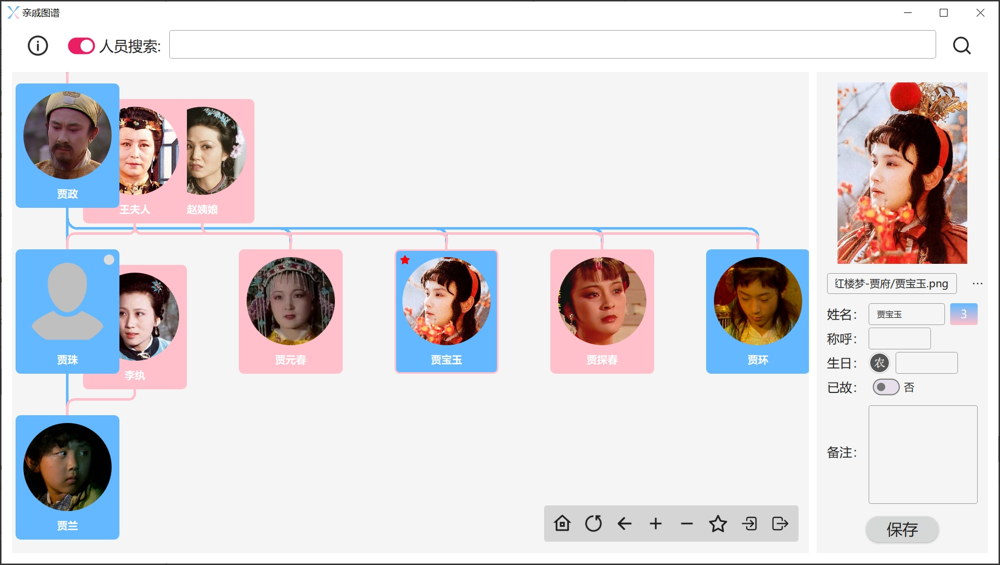

# Kinship Diagram
编织一张自己的**亲戚图谱**，让回家过年的你不再因为不认识人而社恐。

 

## Development Environment

* Qt Creator 15.0.1
* Kit: Qt 6.6.3 MinGW 64-bit
* Compiler: MinGW 11.2.0 64-bit
* OS: Windows 10 Version 22H2
* Architecture: x86_64

 

## Example

以红楼梦为例，软件显示如下：

人员关系显示：

兄弟关系排名调整：

