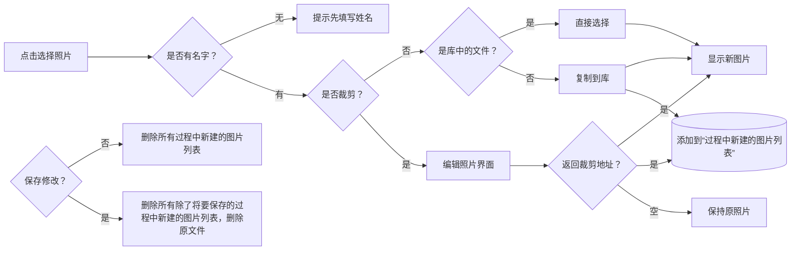
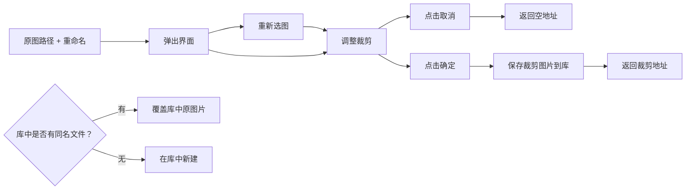

## 名词说明

**近亲**是有血缘关系的**直系血亲**和**三代以内的旁系血亲**。直系血亲指祖（外祖）父母—父母—自己；自己—子女—孙（外孙）子女之间的关系。三代以内的旁系血亲指与自己有同一祖父母或外祖父母的非直系血亲，但在血统上同出一源的亲属，包括自己的叔、伯、姑、舅、姨、兄弟姐妹以及表（堂）兄弟姐妹等。近亲分代计算为共同祖父母（外祖父母）为第一代，依此类推，至本人为第三代。

# 标题

### 产品名称

亲戚图谱

### 版本号

1.0

### 作者/设计者

Easy Wang

### 创建日期

2024-05-27


# 背景

对于一个 95 后来说，曾祖辈的一般来说会有5个甚至更多的子女，小时候过年要记的称呼实在太多，也造成了一定的困扰，尤其是过年或者吃席的时候，叫不上长辈的称呼，看见了又不能装作没看见，即使到了现在，过年走亲戚我还是犯怵，因为到现在我也没搞清楚过。

但是，基于血缘、姻缘的系统是人类一直以来繁衍的基础，对于全世界范围来说，都有适用基础。

2021年，中国基于生育率急剧下降的基础上，开放了3胎的政策。


# 目标

1. 此软件作为一个整体软件的一部分，用于组织亲戚关系，并提供导出给识别设备的能力。
2. 此软件作为一个独立的软件，首先做好中国国内各省份的适配工作，然后推广到全世界。


# 功能

## 核心功能

1. 适配各地亲戚称谓的模板框架编辑
2. 亲戚称谓的自动计算（类似一个爸妈的角色，会指示这个叫xxx）

## 附加功能

1. 名著/名剧 人物关系示例


# 用户界面设计

## 基础设计

### 1. 整体界面

1. Logo 设计（xy的结合）
2. 大于1280*900 时，自由缩放

### 2. 基础功能

1. 新建族谱、族谱导入导出
2. 人员、关系 添加、删除
3. 人员 信息编辑
4. 全图导出
5. 族谱模式：父系、母系、近亲、全部
6. 搜索人员，给出 AB 路径图，显示所搜人员信息

### 3. Config

1. 第一次运行创建默认 Config 文件 —— “def_cfg.json”
2. Config 可以导入/导出，导出时将配置另存为；导入时则替换 “def_cfg.json”


### 4. 人物关系数据库

1. 加密数据库
2. 计算算法设计
3. 加载算法
  1. 先加载父母、兄弟、子女，婚姻关系先加载一层，不向下遍历
  2. 当点击婚姻关系人物时，导航向下一层
  3. 可以向前向后导航
4. 单人选中
  1. 边框闪烁
  2. 单人信息显示当前人物信息
  3. 点击添加按钮显示可以添加的关系（支持同性恋）


### 5. 单人信息

1. 照片选择器
  1. 选择照片
  2. 裁切等比大小
  3. 另存到项目中

2. 照片保存到数据库（加密操作，防止其它软件获取数据）

### 6. 特色功能

1. 称谓模板编辑，适配方言和外语
2. 自动计算称谓
3. 多样式可选

## 详细设计

### 数据库

#### person_list

```sqlite
CREATE TABLE person_list (
    id    INTEGER NOT NULL UNIQUE,
    protagonist   BLOB,
    name  TEXT,
    avatar_path    TEXT,
    gender    BLOB NOT NULL,
    call  TEXT,
    sub_call   TEXT,
    birthday  TEXT,
    birth_trad  BLOB,
    f_rank  INTEGER,
    m_rank  INTEGER,
    is_dead    BLOB,
    death_trad  BLOB,
    death TEXT,
    notes TEXT,
    father    INTEGER,
    mother    INTEGER,
    children  TEXT,
    marriages TEXT,
    PRIMARY KEY(id AUTOINCREMENT)
)
```

* `children` 同样保存的是人员的 id，但是是一个列表，使用 TEXT 保存，使用逗号分隔，如 `3,4`。同时此列表也包含了 子女的年龄排序 信息。

##### marriages

使用一维数组保存婚姻联系。

1. 当处于中国现代婚姻模式时，其需要储存 现任、前任 关系；
2. 当处于中国古代婚姻模式时，对于女性，同样只包含 现任、前任 关系；但对于男性，其需要储存 正妻、前妻、妾 的关系。

对于 **现代模式** 或 **古代的女性** ，包含以下几种情况：

| 现任 | 前任 | 存储  | 说明 |
| ---- | ---- | ----- | ---- |
| 0    | 0    | -1    | 未婚 |
| 1    | 0    | m     |      |
| 0    | 1    | -1,En |      |
| 1    | 1    | m,En  |      |

（0-无， 1-有，m-现任id，En-前任子序列，Qn-妾子序列）

对于 **古代的男性**，包含以下几种情况：

| 正妻 | 前妻 | 妾   | 存储        | 说明                                     |
| ---- | ---- | ---- | ----------- | ---------------------------------------- |
| 0    | 0    | 0    | -1          | 无妾时，同现代模式                       |
| 1    | 0    | 0    | m           |                                          |
| 0    | 1    | 0    | -1,En       |                                          |
| 1    | 1    | 0    | m,En        |                                          |
| 0    | 0    | 1    | -1,-1,Qn    | 当存在妾时，使用 -1 作为妾序列的起始标记 |
| 1    | 0    | 1    | m,-1,Qn     |                                          |
| 0    | 1    | 1    | -1,En,-1,Qn |                                          |
| 1    | 1    | 1    | m,En,-1,Qn  |                                          |

#### user_settings

```sql
CREATE TABLE user_settings (
    setting_key TEXT PRIMARY KEY,
    setting_value TEXT NOT NULL,
    description TEXT)
```

默认数据

```sql
INSERT OR IGNORE INTO user_settings 
    (setting_key, setting_value, description) VALUES
    ('sql_version', '0.2.0', '数据库定义版本号'), 
    ('photo_format', '.png', '默认裁剪保存照片格式：.png/.jpg'), 
    ('marriage_mode', 'modern', '婚姻关系模式：modern(现代)/ancient(古代)'), 
    ('photo_display', 'with_photo', '照片显示模式：with_photo/no_photo');
```

### 人物关系显示

#### 基本元素

* 人员
  * 头像
  * 姓名
  * 称呼
* 关系线
  * 父母
  * 子女
  * 婚姻关系，显示在人员的右下方
    * 现任（红心）
    * 前任（碎心）
    * 妾（粉心）


#### 加载逻辑

##### 父系视图

只显示父系祖先及其子女，婚姻关系仅显示女方，不扩展。

##### 母系视图

同父系。

##### 近亲视图

向上显示：父母、爷奶、外公外婆，再向下显示：爷奶的子孙、曾孙、曾曾孙（即自己的孙子）。

血缘关系的人员显示在前，姻缘关系的人员显示在血缘关系人员之下。

父母、爷奶、公婆的显示位置不变，父母的兄弟向外排列，排行单独显示。

排行包含总排行（老大老二老三）和男女的单独排行（大姐二姐大哥二哥）。指定总排行，单独排行自动计算。

显示顺序：

* 子、孙（左侧对齐，从大到小，深度优先）
* 父母、爷奶、公婆，显示在固定位置
* 由父母，爷奶，公婆，深度优先，爷奶右侧对齐，父母、公婆左侧对齐。
* 最后加载关系。

##### 搜索视图

模式一：转到人员所在位置。在当前页面则将所查找人员居中显示，否则新开一页。（使用搜索框，模糊匹配）

模式二：From - 选择 - To - 选择

##### 全部视图

以世代行排列，显示所有人员。（双击无操作）

##### 操作

* 单击人员：侧边栏显示此人员信息，可编辑保存

* 双击人员：以此人员为中心，显示视图

* 按层加载，可设置最大层次和当前所在层，包含了对层的前进后退操作。

* 顺着关系顺序加载（广度优先方式，按层此扩展），被加载的设置为已加载

  将人员顺序放入待加载列表

#### 选择照片

为人员选择照片的入口有 3 个：添加主人公页面、添加人员页面、人员编辑侧边栏。

这三个入口的组成一致，都是由 照片显示、路径显示框、照片选择按钮 这 3 个部分组成的。

流程如下：



其它注意点：

* 选择不裁剪的照片会自动以 名字+文件后缀 的命名复制到库，如果命名冲突自动加1。
* 软件所引用的照片都会存到库文件夹下。

#### 编辑照片

编辑照片界面包含的流程：



覆盖库中图片的操作给了使用者较高的权限，对比 Windows 的文件同名自动加序号`（1）`的操作，可以替换库中的照片。对于同名的人，给出提示，由使用者手动修改图片名称来规避覆盖操作。

##### 调整裁剪操作

支持以下操作：

* 相框对齐
* 缩放
* 移动
* 旋转

#### 人员关系 添加/删除

点击人员之后，再点击 “工具栏” 中的关系线，可以进入关系编辑界面，可以对此人员的关系进行添加或删除。

关系编辑界面，会显示所有和人员相关的关系列表，列表按照 关系线类型、删除按钮、人员名称、人员头像，对于婚姻关系和子女关系的人员，在末尾还包含上升和下降按钮。

列表下方的一栏为添加栏，包含 可选关系线类型、可选人员名称列表、人员头像、添加按钮。

选择了关系线、人员之后，点击确认即添加完成。关系列表会自动刷新排列，将添加的这一行添加到对于的关系位置，接下来就可以通过升降按钮调整人员位置了。

**注意**：关系编辑界面不可新增人员，只能对已存在的人员关系进行调整。

##### 删除检查

删除关系前执行删除检查。当删除此关系后，会造成从主人公到某个人物的不可达，则不符合删除条件，此时提示 “无法删除此关系，需要先删除 xxx 人员！”。

如此关系可被删除，则提示确认信息，“确定删除此关系？”，点击 “确认” 即完成删除。

##### 上下调整按钮

父母具有唯一性，位置不可调整。

现任具有唯一性，位置位于所有婚姻关系的最上方且不可调整；

对于前任或（古代男性的）妾，可以调整位置，按照结婚时间的先后从上向下排列。

对于子女关系，可以调整位置，按照出生时间的先后从上向下排列。

##### 添加关系

在添加栏中，首先点击 “可选关系类型”，选择关系类型（当 父、母、现任 关系已经存在时，不可选）后，人员列表就会显示可选的人员（为了最大的包容性，只会进行性别过滤、已联系人员过滤），选择人员后，会显示其照片。点击 “添加”，完成添加后，关系列表会自动更新。

## 安装程序生成

暂时只发布平台：Windows

暂时只提供离线安装包。

### 安装逻辑

* 在注册表中查找 "HKEY_LOCAL_MACHINE\\SOFTWARE\\KinshipDiagram" 位置的 "Version"、"InstallDir"
* 如未获取到，则表面此电脑未安装此软件。如获取到了，安装地址栏自动填入 "InstallDir"。
* 对于未安装此软件电脑，全安装。
* 对于安装包版本<=当前版本，提示 “安装包版本<=当前版本”，点击 “退出” 按钮退出安装。
* 对于已经安装，且安装包版本>当前版本，仅覆盖 "KinshipDiagramApp.exe"。
* 安装包含图标，可选生成桌面快捷方式（默认），可选添加到开始菜单（默认），完成时打开软件勾选按钮。
* 安装完成向注册表写入软件安装位置、软件版本。


## 测试计划

* 《红楼梦》族谱图示例：以贾宝玉为主人公的贾府人物关系图谱。
* 《百年孤独》族谱图示例
* 乱伦关系处理示例

